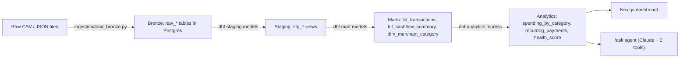

# Open Banking Financial Analytics Pipeline

A bronze → staging → marts → analytics pipeline over two years of real transaction data, with a dashboard and a small agent on top. Built the way an open banking data team would actually build it, not staged to look that way.

The dataset is public: Caixabank Tech, released for a 2024 hackathon. Not proprietary, and not anyone's real transactions. The health score is real math, applied to invented stakes.

## What this demonstrates

- **Schema design**: a star-schema warehouse, shaped by what the raw data actually looked like, not decided in advance. Full reasoning in [`docs/schema.md`](docs/schema.md).
- **Pipeline construction**: bronze (raw, untouched) → staging (typed, cleaned) → marts (star schema) → analytics, built with dbt on Postgres.
- **Data quality practice**: dbt's schema tests, plus seven custom ones checking things like "cash flow totals can't go negative" and "category shares actually sum to 100." If a number doesn't check out, something's supposed to fail.
- **Analytical thinking**: cash flow trends, category spending, a recurring-payment detector that admits its own limits, and a health score built from three components instead of one arbitrary formula.
- **A small agent**: two tools, one demo question, built last, on purpose.

## Architecture



Every column and why it's there lives in [`docs/schema.md`](docs/schema.md). This is just the map.

| Layer | Where | What |
|---|---|---|
| Bronze | `ingestion/load_bronze.py` → `raw_*` tables | Raw files loaded into Postgres (Neon), untouched. No cleaning, no filtering beyond the scope decisions below. |
| Staging | `dbt/financial_pipeline/models/staging/` (`stg_cards`, `stg_transactions`, `stg_users`, `stg_mcc_codes`, `stg_fraud_labels`) | Type casting (`"$29278"` → an actual number), `expires`/`acct_open_date` split into month/year pairs rather than inventing a day that was never in the source, `"Yes"/"No"` → boolean. |
| Marts | `dbt/financial_pipeline/models/marts/` (`fct_transactions`, `fct_cashflow_summary`, `dim_merchant_category`) | Star-schema fact/dimension tables. `fct_transactions` reaches a user via `card_id → dim_cards → user_id`, not a duplicated `user_id` column. Checked zero exceptions across 13.3M rows before deciding that was safe. |
| Analytics | `dbt/financial_pipeline/models/analytics/` (`spending_by_category`, `recurring_payments`, `health_score`) | The layer the dashboard and agent actually read from. |
| Dashboard | `web/` (Next.js, on Vercel) | Cash flow, spending by category, recurring payments, health score explorer. |
| Agent | `web/app/ask`, `web/lib/agent.ts`, `web/lib/tools.ts` | Natural-language Q&A over one user's finances. See [The agent layer](#the-agent-layer) below. |

> **Live dashboard:** https://ob-financial-analytics-pipeline-lfhpb98t3.vercel.app

## Dataset

**Source:** Caixabank Tech, released for the 2024 AI Hackathon. Actual relational structure: separate linked files for transactions, cards, users, merchant codes, not one flattened table someone already did the joining for.

**Files used:** `transactions_data.csv`, `cards_data.csv`, `users_data.csv`, `mcc_codes.json`, `train_fraud_labels.json`.

### Scope-down: why 2017–2018 only

The full dataset spans 2010–2019. Volume climbs from 1.24M transactions (2010) to a peak around 1.39–1.40M/year (2016–2018), then drops to 1.16M in 2019. Not a real decline, just a truncated year (it stops October 31, not December 31). **2017 and 2018 are the two highest-volume years that are each fully represented**, giving ~2.79M transactions across two clean, comparable years, without dragging along eight more years the analysis doesn't need. Full detail in [`docs/scope-decision.md`](docs/scope-decision.md).

That filter is applied once, at ingestion, directly on `transactions_data.csv`. `fraud_labels` doesn't need its own date filter: once transactions are scoped, an out-of-range label just has nothing to join to.

### A second, unrelated scoping reason: `raw_fraud_labels` and a storage cap

`raw_fraud_labels` also ended up filtered to only the transaction IDs present in the 2017–2018 slice. Not a data-quality call this time: a **Neon free-tier 512MB storage cap**. Unfiltered, the full `raw_fraud_labels` table alone was 377MB, plus ~444MB for the 2017–2018 transactions: ~822MB against a 512MB budget, which is a problem regardless of how good the modeling is. Filtering the labels down to the in-scope transaction IDs brought the project to 445MB total, at 67.0% label coverage, matching the 67% coverage found across the *full* dataset. Nothing got skewed; it just dropped labels that could never join to anything downstream anyway.

## Key data quality decisions

- **Duplicate transactions are flagged, not deleted.** 36 transactions (within the 2017–2018 scope) share the same card, minute-level timestamp, merchant, and amount as another row under a different `transaction_id`. Reads like a genuine duplicate-write in the source system, not coincidence. They stay in `fct_transactions`, flagged, so nothing silently disappears, but they're excluded from `fct_cashflow_summary` and anything else that totals money, because counting them twice isn't a data-quality nuance. It's just wrong.
- **Zero-amount transactions are flagged, not filtered anywhere.** 10,639 transactions (0.08%) sit at exactly 0: rarer, and more worth a second look, than negative amounts (~5% of rows, ordinary refunds). Unlike duplicates, these are genuinely ambiguous: could be authorization holds. So the pipeline flags them and leaves the call to whoever's actually using the number.
- **`fraud_labels` is joined with a `LEFT JOIN`, never an `INNER JOIN`.** Labels cover 67% of transactions. Treat that as "every transaction has one" and a third of the data quietly vanishes from any query that touches it.
- **Recurring payment detection is an honest low-confidence heuristic, not a finished subscription list.** There's no merchant name in this data, just an opaque ID and a location, so amount-and-interval matching can't tell a real subscription from a coincidentally similar weekly coffee habit. The data agrees: every one of the 47 detected series sits at exactly the minimum 3 occurrences allowed, several small and weekly. The profile of a coffee habit, not a subscription. The dashboard says this next to the table, not just here.
- All of the above is enforced by an actual dbt test (`assert_no_zero_income_users`, `assert_recurring_min_occurrences`, `assert_recurring_span_consistent`, `assert_cashflow_non_negative`, `assert_category_shares_sum_to_100`, `assert_health_score_bounded`, `assert_no_zero_avg_outflow_users`). Every figure has to tie back to another figure, and when it doesn't, there's a reason worth finding.

## The agent layer

`/ask` answers a natural-language question about one user's finances. *"Why did user 1664's spending increase in October 2017?"* is the one it's actually been tested against. It's small on purpose: **two tools** (`get_cashflow_trend`, `get_spending_by_category`), both scoped to a single `user_id` so it can never mix data across people, calling Claude in a plan → tool-call → validate loop. It decides which tool to call, looks at what comes back, decides if it needs another call, then answers using only that.

The loop's shape takes inspiration from how agentic research tools like [Dexter](https://github.com/virattt/dexter) (an open-source financial research agent by virattt) structure their reasoning: specifically plan → tool-call → validate. It's built independently, against this project's own tools and data. No Dexter code, no dependency on it.

Built last, on top of an already-working pipeline, and scoped down hard: two tools instead of a bigger toolset, one demo question that reliably works instead of several that might. Same note, in context, at the top of `web/lib/agent.ts`.

## Honest framing

- This is a personal portfolio project. No real data, systems, or users are used or referenced anywhere in this repo.
- The dataset is public and real-provenance (Caixabank Tech, 2024 AI Hackathon), not proprietary, not collected from any real end user of any product.
- The health score and the `/ask` agent's answers are illustrative outputs of a portfolio project, not real financial advice, and not any real product's scoring methodology.
- Dexter is credited above as an inspiration for the agent's reasoning loop, not a dependency. No Dexter code is present in this repo.

## Running it yourself

**Pipeline (Python + dbt):**

```bash
python -m venv venv && source venv/bin/activate
pip install -r requirements.txt
cp .env.example .env   # fill in your own Neon Postgres connection details
python ingestion/load_bronze.py
cd dbt/financial_pipeline && dbt build
```

**Dashboard + agent (Next.js):**

```bash
cd web
npm install
cp .env.local.example .env.local   # DATABASE_URL + ANTHROPIC_API_KEY
npm run dev
```

Then open `http://localhost:3000`.

## Repo layout

```
ingestion/          bronze-layer loader (raw files -> Postgres)
dbt/financial_pipeline/   staging -> marts -> analytics dbt project, plus custom tests
docs/                schema design writeup + scope-decision writeup
web/                 Next.js dashboard + /ask agent
scripts/             one-off data inspection scripts used during Phase 1
```
