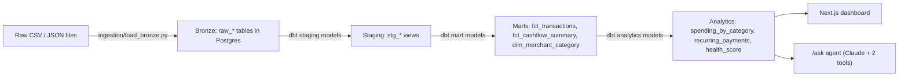

# Open Banking Financial Analytics Pipeline

A data engineering portfolio project: a full bronze → staging → marts → analytics pipeline over real transaction-level financial data, a Next.js dashboard on top of it, and a small agentic natural-language layer for asking questions about a single user's finances.

The domain — transaction aggregation, spending categorization, recurring payment detection, a financial health score — mirrors what an open banking / personal finance product's data team builds day to day. The dataset, however, is public and synthetic-provenance (see [Honest framing](#honest-framing) below): **this is not built for, with, or using any real fintech's data.**

## What this demonstrates

- **Schema design** — a star-schema-style warehouse (dimensions + facts) designed from first inspecting the raw data, not assumed in advance. See [`docs/schema.md`](docs/schema.md) for the full ER diagram and the reasoning behind every modeling choice.
- **Pipeline construction** — a bronze (raw, unmodified) → staging (cleaned, typed) → marts (star schema) → analytics (business logic) layering, built with dbt on Postgres.
- **Data quality practice** — dbt schema tests (`not_null`, `unique`, `relationships`, `accepted_values`) plus seven custom singular tests asserting business invariants (e.g. cash flow totals can't be negative, category shares must sum to 100%, health score percentiles must be bounded 0–100).
- **Analytical thinking** — cash flow trends, category-level spending breakdowns, low-confidence recurring-payment detection, and a percentile-based financial health score built from three defensible components rather than an arbitrary weighted formula.
- **Applied agentic AI** — a small, purpose-built natural-language layer (2 tools, one reliable demo question, built last) on top of the same warehouse, not a separate product.

## Architecture



Full table-by-table detail — every column, every modeling decision and why — lives in [`docs/schema.md`](docs/schema.md).

| Layer | Where | What |
|---|---|---|
| Bronze | `ingestion/load_bronze.py` → `raw_*` tables | Raw files loaded into Postgres (Neon) completely unmodified. No cleaning, no filtering beyond the scope decisions below. |
| Staging | `dbt/financial_pipeline/models/staging/` (`stg_cards`, `stg_transactions`, `stg_users`, `stg_mcc_codes`, `stg_fraud_labels`) | Type casting (e.g. `"$29278"` → numeric), `expires`/`acct_open_date` split into month/year integer pairs rather than fabricating a day, `"Yes"/"No"` → boolean. |
| Marts | `dbt/financial_pipeline/models/marts/` (`fct_transactions`, `fct_cashflow_summary`, `dim_merchant_category`) | Star-schema fact/dimension tables. `fct_transactions` reaches a user via `card_id → dim_cards → user_id`, not a duplicated `user_id` column (verified zero exceptions across 13.3M source rows before deciding this). |
| Analytics | `dbt/financial_pipeline/models/analytics/` (`spending_by_category`, `recurring_payments`, `health_score`) | The business-logic layer the dashboard and agent both read from. |
| Dashboard | `web/` (Next.js, deployed on Vercel — *link pending, see below*) | Cash flow trend, spending by category, recurring payments, health score explorer. |
| Agent | `web/app/ask`, `web/lib/agent.ts`, `web/lib/tools.ts` | Natural-language Q&A over one user's finances. See [The agent layer](#the-agent-layer-not-a-dexter-fork) below. |

> **Live dashboard:** not yet deployed to Vercel. Until then, run it locally — see [Running it yourself](#running-it-yourself).

## Dataset

**Source:** Caixabank Tech financial dataset, released for the **2024 AI Hackathon**. Real relational structure — separate linked files for transactions, cards, users, and merchant category codes — rather than one pre-flattened table, which is what made it worth using over a purely generated alternative.

**Files used:** `transactions_data.csv`, `cards_data.csv`, `users_data.csv`, `mcc_codes.json`, `train_fraud_labels.json`.

### Scope-down: why 2017–2018 only

The full dataset spans 2010–2019. Inspecting it first showed transaction volume climbing from 1.24M (2010) to a peak of ~1.39–1.40M/year in 2016–2018, then dropping to 1.16M in 2019 — not a real decline, but because the 2019 data is truncated (it ends October 31, not December 31). **2017 and 2018 are the two highest-volume years that are each fully represented**, giving ~2.79M transactions across two clean, comparable years without carrying eight years of data the project doesn't need. Full detail in [`docs/scope-decision.md`](docs/scope-decision.md).

That filter is applied once, at ingestion, directly on `transactions_data.csv`. `fraud_labels` doesn't need a separate date filter — once transactions are scoped, any label referencing an out-of-range transaction simply has no match.

### A second, unrelated scoping reason: `raw_fraud_labels` and Neon's free-tier storage cap

Separately from the above, `raw_fraud_labels` also ended up filtered down to only the transaction IDs present in the 2017–2018 slice — but that wasn't a data-quality choice, it was forced by **Neon's free-tier 512MB total project storage cap**. Loading everything unfiltered first showed the full, all-years `raw_fraud_labels` table alone at 377MB, plus ~444MB for the 2017–2018 transactions — ~822MB against a 512MB budget. Filtering the labels down to just the in-scope transaction IDs brought the project to 445MB total, at 67.0% label coverage — consistent with the 67% coverage found across the *full* dataset, so the filtering didn't skew anything, it just removed labels that could never be joined to anything downstream anyway.

## Key data quality decisions

- **Duplicate transactions are flagged, not deleted.** 36 transactions (within the 2017–2018 scope) share the same card, minute-level timestamp, merchant, and amount as another row under a different `transaction_id` — reading like a genuine duplicate-write artifact in the source system. They stay in `fct_transactions` (flagged `is_duplicate_candidate`, for audit visibility), but are excluded from `fct_cashflow_summary` and should be excluded from any future financial-total calculation, since letting them inflate a spending total would misrepresent the real numbers.
- **Zero-amount transactions are flagged, not filtered anywhere.** 10,639 transactions (0.08%) have an amount of exactly 0 — rarer and more worth a second look than negative amounts (~5% of rows, read as ordinary refunds/reversals). Unlike duplicates, these are ambiguous (could be legitimate authorization holds), so the pipeline only surfaces the flag and leaves the filtering decision to whatever consumes it.
- **`fraud_labels` is joined with a `LEFT JOIN`, never an `INNER JOIN`.** Labels exist for only 67% of transactions — modeling it as "every transaction has one" would silently drop a third of transactions from any query that touches it.
- **Recurring payment detection is an honest low-confidence heuristic, not a finished subscription list.** The dataset only has an opaque `merchant_id` and a location — never a merchant name — so amount-and-interval matching alone can't distinguish a genuine recurring subscription from someone's coincidentally similar weekly coffee habit. Consistent with that limitation: every one of the 47 detected series sits at exactly the minimum 3 occurrences allowed, and several are small, weekly, low-dollar amounts — the profile of repeat everyday purchases, not typical subscriptions. The dashboard surfaces this caveat directly next to the table, not just in this README.
- Every one of the above is enforced or checked by an actual dbt test (`assert_no_zero_income_users`, `assert_recurring_min_occurrences`, `assert_recurring_span_consistent`, `assert_cashflow_non_negative`, `assert_category_shares_sum_to_100`, `assert_health_score_bounded`, `assert_no_zero_avg_outflow_users`), not just described in prose.

## The agent layer (not a Dexter fork)

`/ask` lets you ask a natural-language question about one user's finances (e.g. *"Why did user 1664's spending increase in October 2017?"*). It's deliberately small: **two tools** (`get_cashflow_trend`, `get_spending_by_category`), both scoped to a single `user_id` so the agent can never aggregate or compare across users, calling Claude via the Anthropic API in a plan → tool-call → validate loop — the agent decides which tool(s) to call, looks at the result, decides whether it needs another call, then answers using only what the tools returned.

The loop's shape takes inspiration from how agentic research tools like [Dexter](https://github.com/virattt/dexter) (an open-source autonomous financial research agent by virattt) structure their reasoning — specifically the plan → tool-call → validate pattern. It is **built independently, against this project's own tools and data — not a fork of, or dependency on, the Dexter codebase.**

This layer was built last, on top of an already-working pipeline, and scoped down hard on purpose: 2 tools instead of a larger toolset, one reliable demo question prioritized over breadth. See the comment at the top of `web/lib/agent.ts` for the same note in context.

## Honest framing

- This is a personal portfolio project. **No real Malaa data, systems, or users are used or referenced anywhere in this repo.**
- The dataset is public and real-provenance (Caixabank Tech, released for the 2024 AI Hackathon) — not proprietary financial-institution data, and not collected from any real end user of any product.
- The financial health score and the `/ask` agent's answers are **illustrative outputs of a portfolio project, not real financial advice** and not a real product's scoring methodology.
- Dexter is credited above as an architectural inspiration for the agent's reasoning loop — it is not incorporated as a dependency, and no Dexter code is present in this repo.

## Running it yourself

**Pipeline (Python + dbt):**

```bash
python -m venv venv && source venv/bin/activate
pip install -r requirements.txt
cp .env.example .env   # fill in your own Neon Postgres connection details
python ingestion/load_bronze.py
cd dbt/financial_pipeline && dbt build
```

**Dashboard + agent (Next.js):**

```bash
cd web
npm install
cp .env.local.example .env.local   # DATABASE_URL + ANTHROPIC_API_KEY
npm run dev
```

Then open `http://localhost:3000`.

## Repo layout

```
ingestion/          bronze-layer loader (raw files -> Postgres)
dbt/financial_pipeline/   staging -> marts -> analytics dbt project, plus custom tests
docs/                schema design writeup + scope-decision writeup
web/                 Next.js dashboard + /ask agent
scripts/             one-off data inspection scripts used during Phase 1
```
