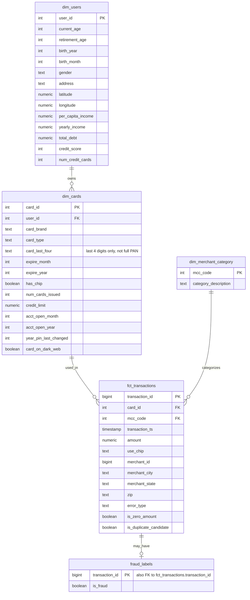

# Warehouse Schema — Phase 2 (Proposal)

Star-schema-style warehouse for the 2017-2018 transaction slice (see [scope-decision.md](scope-decision.md)). This is a proposal for review — no SQL or dbt models exist yet.

This closely follows the sketch in `malaa-project-roadmap.md` Phase 2, refined with what Phase 1 actually found in the data.

## ER Diagram

## Table-by-table, in plain terms

**dim_users** — one row per person. Straightforward copy of `users_data`, with the money fields (`per_capita_income`, `yearly_income`, `total_debt`) converted from `"$29278"`-style text into actual numbers, since that's how they arrive in the raw file.

**dim_cards** — one row per card, linked to the user who owns it. Two things changed from a literal copy of `cards_data`:
- `expires` and `acct_open_date` come in as `"12/2022"` — a month and year, no real day. Rather than force that into a full date (which would fabricate a day that was never in the source data — e.g. pretending it's always the 1st), this keeps them as plain `expire_month`/`expire_year` (and same for account-open) integer pairs. Nothing is invented that wasn't in the source.
- `card_number` and `cvv` are **not carried into the warehouse**. This dataset is synthetic, but the pattern being modeled here is the real one: a real financial system never persists CVV anywhere past the original authorization, and never exposes a full card number in an analytics layer — only enough to identify a card to a human (last 4 digits). `dim_cards` keeps `card_last_four` instead of the full number, and drops `cvv` entirely.

**dim_merchant_category** — the smallest table, just the 109 MCC codes and their descriptions from `mcc_codes.json`. It's a pure lookup table, nothing more.

**fct_transactions** — one row per transaction, filtered to 2017-2018. It links to `dim_cards` via `card_id` only — **there's no separate `user_id` column here**, even though the raw file has `client_id` on every transaction. Phase 1 checked this directly: every transaction's `client_id` matched the `client_id` on its own referenced card, with zero exceptions across all 13.3M rows. Since that value is always derivable by following `card_id → dim_cards → user_id`, storing it a second time on every transaction row would just be duplicating data that's already guaranteed to agree — so it's left out, and you reach the user by joining through the card.

A few other things live directly on this table rather than in a separate lookup, because they don't have any extra descriptive detail to justify their own table: `use_chip` (just a 3-4 value label), and the merchant fields (`merchant_id`, `merchant_city`, `merchant_state`, `zip`) — the raw data has no merchant *name*, just an ID and a location, so a separate "merchant" dimension would only ever contain an ID and an address, which isn't worth the extra join. `zip` specifically is kept as text, not a number — Phase 1 showed it loads as `58523.0` by default, and a real US zip code with a leading zero (like Massachusetts or Puerto Rico ones) would silently lose that digit if stored numerically.

Two flags come straight from Phase 1 findings, and both **flag rows, they don't remove them** — dropping data is a modeling decision for Phase 4, not something to bake into the schema silently:
- `is_zero_amount` — true for the 10,639 transactions (0.08%) where amount is exactly 0. Rarer and more worth a second look than negative amounts, which at ~5% of all rows are common enough to read as ordinary refunds/reversals rather than a data problem.
- `is_duplicate_candidate` — true for the ~200 transactions Phase 1 found sharing the same card, minute-level timestamp, merchant, and amount as another row, under a different `transaction_id`. The examples pulled during Phase 1 (adjacent IDs, identical everything) read like a genuine duplicate-write artifact in the source system, not coincidence — but this schema just surfaces them for visibility. What to do about them (drop, keep, alert on) is a Phase 4 decision.

`errors` becomes `error_type` here — it's 98.4% null (only ~1.6% of transactions have any error text at all), kept nullable rather than dropped, in case it's useful later for a data-quality or anomaly angle.

**fraud_labels** — deliberately **not** modeled as a core dimension, and not merged into `fct_transactions` either. Phase 1 found labels exist for only 67% of transactions, so treating it as a normal "every transaction has one" table would be wrong — the relationship is one transaction to *zero or one* label (shown as `||--o|` in the diagram), meaning any join to it must be a `LEFT JOIN`, never an `INNER JOIN`, or a third of transactions would silently disappear from any query that touches it. Every label's `transaction_id` was confirmed in Phase 1 to match a real transaction (0 orphans), so the relationship is safe in that direction. The raw `"Yes"/"No"` text becomes a real `is_fraud` boolean.

## Considered and left out (for now)

- **A negative-amount flag** alongside `is_zero_amount` — not added, since ~5% of rows being negative is common enough to treat as normal refund/reversal behavior rather than a quality flag. Worth revisiting if Phase 5's anomaly detection wants it.
- **A `dim_date` calendar table** — a common star-schema pattern for rollups (month/quarter/day-of-week), but with only a 2-year slice, plain date functions on `transaction_ts` cover the planned monthly/month-over-month analytics without the extra table. Could be added later if the analytics layer outgrows that.

## Where this matches vs. deviates from the roadmap sketch

The overall shape matches `malaa-project-roadmap.md` Phase 2 closely — same five tables, `transactions` linked to `cards` (not a separate user FK) exactly as originally sketched, `fraud_labels` as an optional FK-linked table exactly as sketched. The deviations are the ones called out above: card PAN/CVV handling, month-only date fields, `zip` as text, and the two data-quality flags — all direct consequences of what Phase 1 actually found, not stylistic changes.
